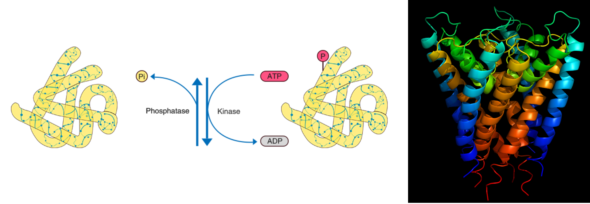

# Goal
Classification of protein function based on their sequences. 

**The protein function  which the project focusses is the ATP binding of proteins.**

# Description 
Protein phosphorylation is a reversible post-translational modification of proteins in which an amino acid residue is phosphorylated by a protein kinase. Phosphorylation alters the structural conformation of a protein, causing it to become activated, deactivated, or modifying its function. Approximately 13000 human proteins have sites that are phosphorylated [wikipedia].

# Data collection

Data scraping was performed on several protein sequence and their function from biological databases mainly [Unitprot](https://www.uniprot.org/uniprot/P03960).

>**data-scrapes** folder contains the sequence in the fasta format and annotation of the various proteins.

# Approach 
The sequence of the protein were augmented after 500 residues. The sequences, which had lower length were artifically padded with '_'.
I used Artifical Neural Network (ANN) to classify the protein function (obtained after hyperparameter tuninng) :  

|     Method    |   Numbers
| ------------- | ------------- |
|      ANN    | 2/3  layers |
| Embedding dim  | 10      |
| Sequence length | 23 |
| Optimizer     | Stochastic Gradient Descent (SGD)   |
| Loss | Binary crossentropy | 
| Nodes | 128|
|Batch size | 128 |
|Learning Rate | 0.001 |
|Accuracy Score | 0.95 |
|Precision Score | 0.93|
|Recall Score | 0.93|
|**F1-macro**| **0.93**|

